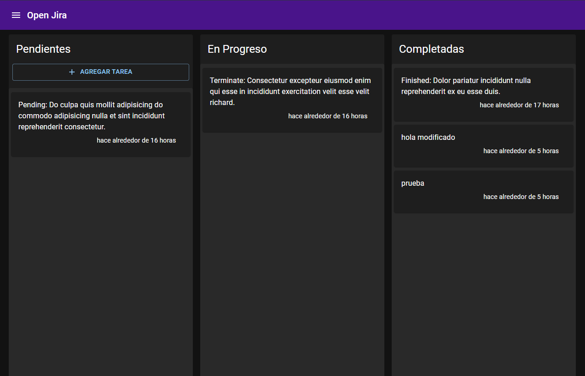

# Next.js - Open Jira app

Clon de Jira

## Configuararciones iniciales

- Reconstruir los modulos con `npm i`

    Importante agregar `mongo/` al gitignore

- Para correr localmente necesita la DDBB, tener docker desktop corriendo y ejecutar:

        docker compose up -d

- Para correr el proyecto - Se utilizo `yarn` o `npm`

      npm run dev
      # or
      yarn dev

   Open [http://localhost:3000](http://localhost:3000) with your browser to see the result.

- Cadena de conexion con MongoDB local

      mongodb://localhost:27017/entriesdb

- Llenar la DDDBB con datos de prueba - LUEGO DE USAR EL COMANDO NO USES ESTE COMANDO O ELIMINA EL FILE /page/api/seed

      GET - localhost://localhost:3000/api/seed

- CDN en el _document

      <link
        rel="stylesheet"
        href="https://fonts.googleapis.com/css?family=Roboto:300,400,500,700&display=swap"
      />

- Configuarar variables de entorno

- MongoDB URL Local, para conexion con la base de datos.

      mongodb://localhost:27017/entriesdb

## Dependecias

    yarn add @mui/material @emotion/react @emotion/styled
    yarn add @mui/icons-material
    yarn add uuid
    yarn add notistack
    yarn add date-fns

## Enlaces

- [Material UI](https://mui.com/)
- [Drag & Drop react-beautiful-dnd](https://www.npmjs.com/package/react-beautiful-dnd)
- [Codigos de respuesta http](https://developer.mozilla.org/es/docs/Web/HTTP/Status)
- [Middleware Next](https://nextjs.org/docs/advanced-features/middleware)
- [Guia de migración Middleware Next](https://nextjs.org/docs/messages/middleware-upgrade-guide#breaking-changes)
- [Snackbar](https://mui.com/material-ui/react-snackbar/)
- [notistack - con Provider](https://github.com/iamhosseindhv/notistack)
- [date-fns](https://date-fns.org/)

## Notas - Errores y Ocurrencias

   1. Nota: Quitar el scroll Y and X ejemplo en pages /EntryLlist {styles.paper}

   2. Ocurrencia: La Propiedad `draggable` de Card no es soportada en "Brave"

   3. Nota: con Next puedes usar variables de entorno anteponiendo `NEXT_PUBLIC_NAME`

   4. Nota: Expresión regular para validar `Mongo Id`

      | const checkMongoIDRegExp = new RegExp("^[0-9a-fA-F]{24}$");

   5. Nota: uso de `notisnack` ejemplo en /EntriesProvider;

   6. Nota: uso de `date-fns` ejemplo en /EntryCards implementación en `utils`

   7. La propiedad `sx=` es igual a `style=` ademas tiene acceso al theme

## Temas tocados en este proyecto

   1. Manejo del contexto

   2. Material UI

   3. Temas de Material UI

   4. Creación de snippets

   5. MongoDB

   6. Docker-compose

   7. Volumenes de docker

   8. Semillas de base de datos

   9. Validaciones

   10. Next.js Middlewares (Nuevo desde Next.js 12.0.0)

   11. Crear en base de datos

   12. Actualizar en base de datos

   13. Leer desde base de datos

   14. Mantener persistente nuestra data

   15. Context - provider - reducer

